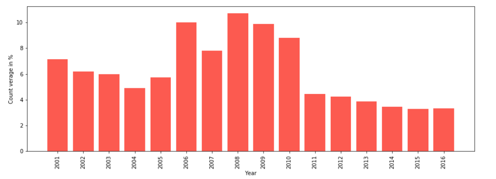
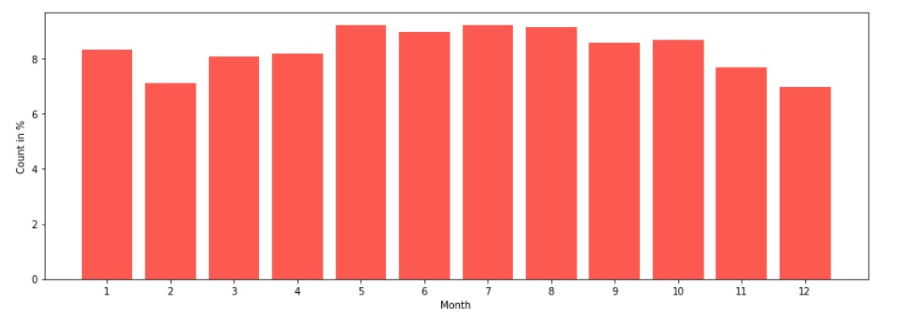
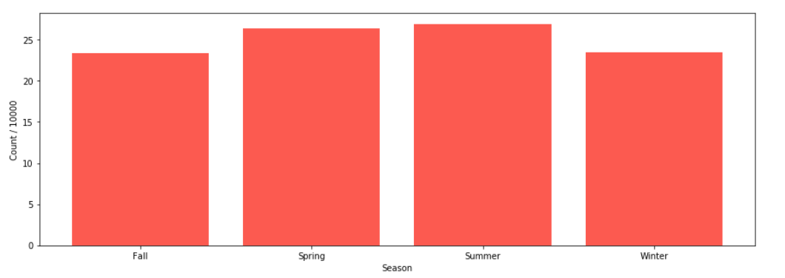
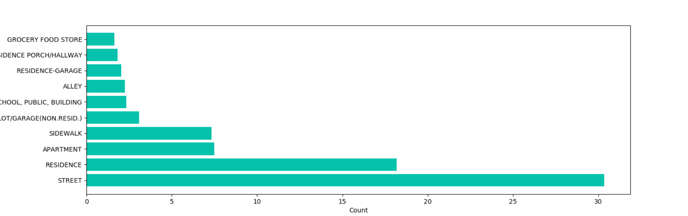
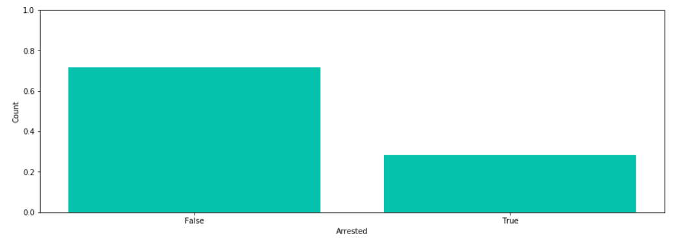
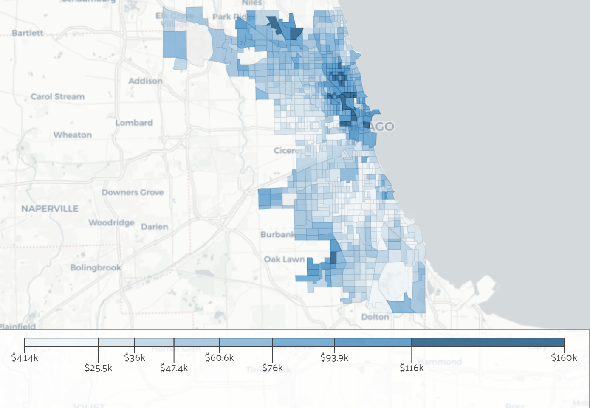
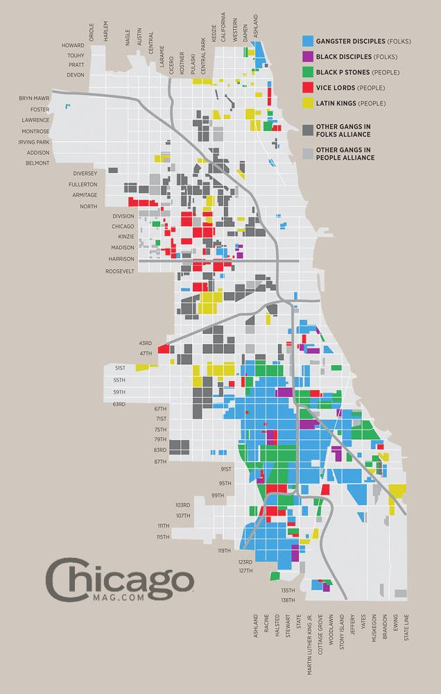

# Crimes in Chicago
https://www.kaggle.com/currie32/crimes-in-chicago

## Končno poročilo

## Skupina

 * Jože Fortun
 * Neža Vehovar
 * Tomaž Jerman

### Začeli smo tako da smo za vsako leto od 2001 do 2016 prešteli število kriminalnih dejanj in jih izrisali v grafu:

### Enako smo naredili za mesece v letu:

### In za letne čase:

### Nato smo izrisali graf vrst kriminala:

### Graf  10 najpogostejših lokacij kriminala:

### In nazadnje, delež aretacij.

# Podatki prikazani na zemljevidu

## Prihodek na gospodinjstvo

## Lokacije tolp v Chicagu

# Spreminjanje kriminala čez leta na zemljevidu

Skozi leta se je lokacija kriminala v Chicagu spreminjala. Naredili smo "heat map" lokacije kriminala za vsako leto, in z gifom predstavili spreminjanje le tega.

## Spreminjanje različnih tipov kriminala čez leta

### Napad

### Napad s hudo telesno poškodbo

### Ropanje

### Vlom

### Prostitucija

### Kriminal povezan z drogo

### Kraja motornega vozila

## Spreminjanje aretacij čez leta na zemljevidu

Prav tako se lokacija aretacij skozi leta spreminja, ta gif "heat map-ov" nam prikaže kako se je lokacija policajev skozi leta spreminjala. Policaji povečajo prisotnost tam kjer se dogaja več kriminala, ker se kriminal premika a hkrati ostaja prevladujoč na določenih lokacijah (Oak park, Milenium park)

