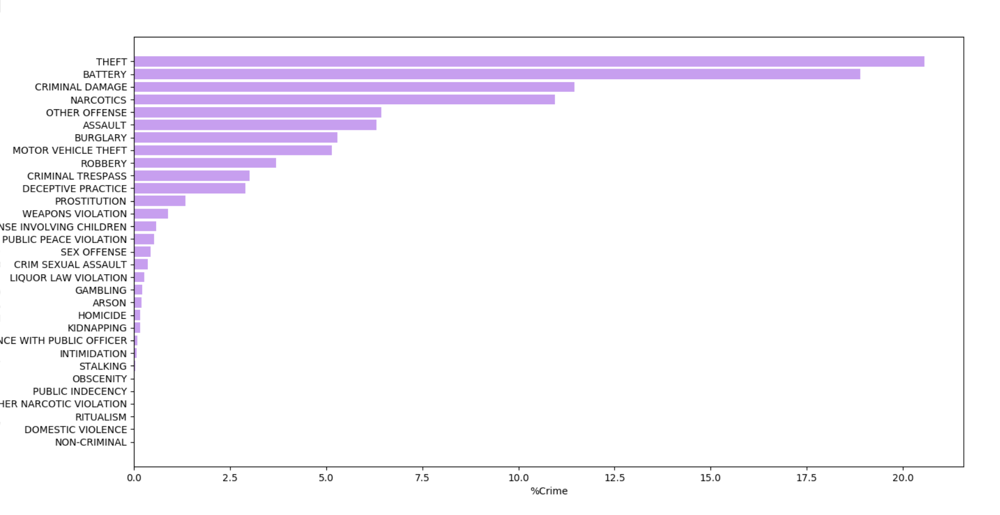

# Crimes in Chicago
https://www.kaggle.com/currie32/crimes-in-chicago

## Končno poročilo

## Skupina

 * Jože Fortun
 * Neža Vehovar
 * Tomaž Jerman

# Osnovne statistike

### Začeli smo tako da smo za vsako leto od 2001 do 2016 prešteli število kriminalnih dejanj in jih izrisali v grafu:

Na grafu se vidi, da se je število krimninalnih dejanj iz leta 2005 do 2011 naraslo. Od leta 2011 pa je v padcu. 
Ta padec v kriminalu lahko pripišemo novemu županu, ki je naredil velike reforme v policiji.
Trenuto Chicago beleži 14 mesec, ki ima nižjo stopnjo kriminala kot prejšnji mesec

### Enako smo naredili za mesece v letu:

### In za letne čase:

Logično se zdi, da se stopnja kriminala poveča ko je zunaj bolj vroče in zmanjša, ko je mrzlo.

Zanimalo nas je tudi, če polna luna vpliva na kriminal. Iskazalo se je, da nima takega velikega vpliva. 
Število kriminalnih dejanj se je povečalo za manj kot procent, v primerjavi z dnevom, ko ni bilo polne lune.

### Nato smo izrisali graf vrst kriminala:

V Chicagu prevladuje kraja, ki je kar petina vseh zločinov. 
Na drugem mestu so napadi s hudo telesno poškodbo, ki predstavljajo malo manj kot petino zločinov.
Blizu za njimi sta kriminalna škoda in zločini povezani z drogami.
Ostale vrste kriminala so manj pogoste. 
Chicago ima kar 11% kriminala, ki je nasilne vrste. Državno poprečje ZDA je 4%.

### Graf  10 najpogostejših lokacij kriminala:

Chicago ima veliko tolp zato nismo presenečeni da se kar 30% vsega kriminala zgodi na cesti. Od kraje, do preprodaje drog in strelskih obračunov med tolpami. 
Stopnja kraje in vlomov je velika zato so prebivališča drugo najpogostejše mesto kjer se odvija kriminal.

### In nazadnje, delež aretacij.

Delež aretacij je 25%. To je lahko zato ker ne odkrijejo storilca kriminalnega dejanja, ali pa dejanje ne zahteva aretacije. 
Z dodatno raziskavo smo ugotovili, da veliko umorov, kraje in napadov ostane nerešenih, kar posledično vpliva na delež aretiranih glede na vse zločine.

# Podatki prikazani na zemljevidu
Za lažjo vizualizacijo smo poiskali zemljevide Chicaga, ki so vsebovali informacije zanimive za naš projekt.
Nato pa smo z pomočjo GoogleMaps API izrisali "heat mape" kriminala na sploh in določenih tipov. Te slike smo spremenili v gife za lažjo simulacijo časa.

## Prihodek na gospodinjstvo

Zanimalo nas kako prihodek vpliva na stopnjo kriminala na tistem področju.

## Lokacije tolp v Chicagu

Prav tako je zanimivo kje so tolpe najbolj aktivne in kako to vpliva na lokacijo kriminala v mestu.

# Spreminjanje kriminala čez leta na zemljevidu

Gif prikazuje kako se je lokacija vsega kriminala spreminjala skozi leta. 

## Spreminjanje različnih tipov kriminala čez leta

### Napad

Lokacija napadov po mestu.

### Napad s hudo telesno poškodbo

Lokacija napadov s hudo telesno poškodbo po mestu.

Zanimivo je da se lokacije obeh vrst napadov pokrivajo z lokacijo tolp v Chicagu.

### Ropanje

Lokacija ropov v mestu. Teh je največ tam kjer so bolj premožni ljudje, kar je tudi logično.

### Vlom

Lokacija vlomov v mestu. Te pa niso najbolj pogosti tam kjer so bogati, sklepamo za to ker je težje priti v bogato stanovanje, kot pa bogatega človeka oropati na cesti.
Boljše stanovanje, več je tudi varnosti pred vlomilci.

### Prostitucija

Eden izmed najbolj zanimivih gifov. Vidi se kot pričakovano, da je največ prostitucije na glavnih ulicah, tam kjer so ljudje manj premožni. Zanimivo pa je, da bolj ko gremo k sedanjosti, manj je prostitucije. V letu 2016 je skoraj ni več. 
Razlogov je lahko več.

### Kriminal povezan z drogo

Lokacije kjer je v Chicagu največ droge. Ta gif vključuje proizvodnjo, preprodajo in uživanje drog. 
Te je največ tam kjer se zadržujejo tolpe. Kar je tudi logično saj je to njihov glavni vir prihodka.
Prav tako je droge najmanj tam kjer so srednje premožni ljudje. 
Droge se pojavljajo predvsem  v revnih, pa tudi v bogatih predelih mesta.

### Kraja motornih vozil

Kot večino kriminala se tudi kraja motornih vozil največ dogaja tam kjer se zadržujejo tolpe. 
Sicer se čez leta dosti lokacij spreminja, ampak žarišča ostajajo enaka.

## Spreminjanje aretacij čez leta na zemljevidu

Največ aretiranih je spet tam kjer se najbolj pojavljajo tolpe(Oak park).
V Milenium Parku je povečana prisotnost policajev ker so to premožne četrti, zato je logično da je tam več aretacij.

